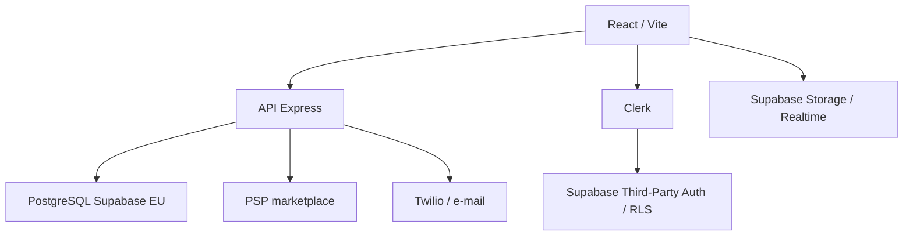

# Architecture cible SILO

## Priorite des sources

En cas de contradiction, l'ordre suivant fait foi :

1. corrections explicites validees par la direction ;
2. `Business_Plan_SILO_Banque_2026_2029(1).pdf` du 25 juillet 2026 ;
3. `Cahier Des Charges Technique silo (4).pdf` du 15 juillet 2026 ;
4. comportement du code Replit existant ;
5. anciennes variantes Canva et donnees de demonstration.

La repartition financiere validee est toujours calculee sur le HT :

- 70 % pour les prestataires ;
- 20 % de commission brute SILO ;
- 10 % pour le FRP.

## Etat repris

Le depot contient un monorepo pnpm TypeScript avec :

- une application React/Vite ;
- une API Express ;
- un schema PostgreSQL Drizzle ;
- un contrat OpenAPI et des clients generes ;
- des migrations Supabase historiques ;
- quatre espaces : client, partenaire, conseiller et administration.

Le typage passe. Plusieurs parcours restent toutefois simules ou doubles entre
Drizzle et Supabase. Le projet Supabase connecte contient actuellement
l'Academie SILO, pas les donnees commerciales de la plateforme.

## Cible

| Domaine | Decision |
|---|---|
| Interface | Conserver React/Vite et les espaces existants, puis remplacer les mocks par parcours |
| API | Conserver Express pour les autorisations, webhooks, calculs et integrations sensibles |
| Authentification | Conserver Clerk en V1 via l'integration officielle Supabase Third-Party Auth ; reevaluer une migration apres convergence avec l'Academie |
| Donnees | Utiliser PostgreSQL Supabase en region UE, dans un perimetre plateforme distinct |
| Fichiers | Supabase Storage avec chemins prives et regles par projet |
| Temps reel | Supabase Realtime pour le feed et les notifications |
| Paiements | PSP adapte aux plateformes et aux fonds de tiers ; aucun cantonnement artisanal |
| Telephonie | Twilio pour SVI, appels, vocaux, SMS et suivi de livraison |
| WoWSQL | Projet vide en region `ap-south-1` : reserve au prototypage, pas retenu pour la production UE |

## Frontieres de securite

- Toutes les autorisations sont appliquees cote serveur.
- Un utilisateur ne peut acceder qu'aux projets dont il est membre.
- Les notes internes et escalades ne quittent jamais l'API vers un client.
- Les fonctions sensibles sont desactivees par defaut.
- Les montants internes SILO et FRP ne sont jamais retournes au client.
- Les secrets, cles privees et roles de service ne sont jamais exposes au navigateur.
- Les webhooks de paiement et de telephonie sont verifies avant traitement.
- Le navigateur utilise une cle Supabase publiable ; les anciennes cles `anon`
  restent uniquement un repli transitoire avant leur retrait fin 2026.

## Ordre de reconstruction

1. Rendre le depot portable et reproductible hors Replit.
2. Unifier les regles metier et financieres dans un module partage teste.
3. Fermer les acces directs non autorises aux projets et au feed.
4. Creer le schema operationnel avec migrations et politiques d'acces.
5. Remplacer les mocks des parcours critiques par l'API.
6. Integrer le PSP, les contrats, les notifications et la telephonie.
7. Tester chaque role sur mobile et bureau avant deploiement.

## Deploiement des donnees

Aucune migration de la plateforme commerciale ne doit etre appliquee directement
sur le projet Supabase qui heberge l'Academie sans sauvegarde, branche de
developpement ou validation explicite. Les migrations sont d'abord versionnees
et testees localement.

## Domaine de production

Le domaine public retenu est `silovisuel.com`. La configuration de production
doit utiliser :

- `https://silovisuel.com` comme URL canonique de l'application ;
- `https://www.silovisuel.com` comme alias redirige vers le domaine canonique ;
- `https://api.silovisuel.com` pour l'API et les callbacks Twilio/Stripe ;
- HTTPS obligatoire sur les trois noms ;
- les secrets Tally, Stripe, Twilio, Clerk et Supabase uniquement dans le
  gestionnaire de secrets de l'hebergeur.

La mise en ligne necessite encore le choix de l'hebergeur, la creation des
enregistrements DNS et l'ajout des URLs de production dans Clerk, Supabase,
Stripe et Twilio.

## Formulaires Tally

- Demande client : `https://tally.so/r/rjWGb2`
- Candidature partenaire : `https://tally.so/r/ob1v7x`

Le formulaire partenaire est publie et contient l'introduction SILO native
avant les informations principales. La cle API Tally reste strictement cote
serveur et n'est jamais versionnee dans le depot.
